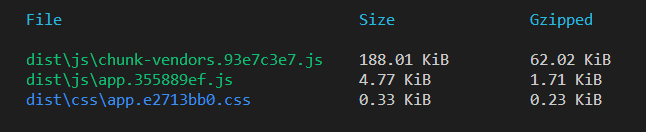
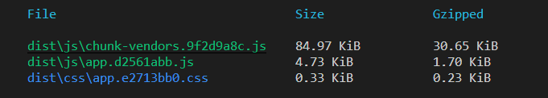

webpack2.0之后就开始支持树摇的操作，树摇的意思就是摇掉不需要或者未使用的代码，之前在写 d-utils 库的时候发现，当方法越来越多，代码越来越多的时候，在项目中引入之后打包，发现打包的js达到300kb，然而对于我实际上用的方法也就5个左右，这会造成打入了很多无用的代码，于是优化开始了
<!-- more -->

tree shaking 是一个术语，通常用于描述移除 JavaScript 上下文中的未引用代码(dead-code)。它依赖于 ES2015 模块语法的 静态结构 特性，例如 import 和 export。这个术语和概念实际上是由 ES2015 模块打包工具 rollup 普及起来的。

### 如何让自己的代码支持tree-shaking?
- 使用 ES2015 模块语法（即 import 和 export）
- 通过将 mode 选项设置为 production，启用 minification(代码压缩) 和 tree shaking。
- 无副作用的代码
- class包装方法无法tree-shaking

### 优化的方式
```ts
// a.ts
export default class A {
  func1 () {},
  func2 () {}
}

// main.ts
import A from 'a'
A.func1()
```
此时打包该项目的时候会发现，我并没有使用的func2也被打进包里，如果想移除func2只能这样

```ts
// a.ts
export const func1 = () => {}
export function func2 () {}

// main.ts
import { func1 } from 'a'
func1()
```
这时候是可以成功移除掉func2的代码的，至于为什么class不可以 https://github.com/rollup/rollup/issues/349

### 结果
将部分文件的代码优化成方法的export导出形式，对一个项目的同样代码进行打包查看结果，
优化之前：

优化之后：

