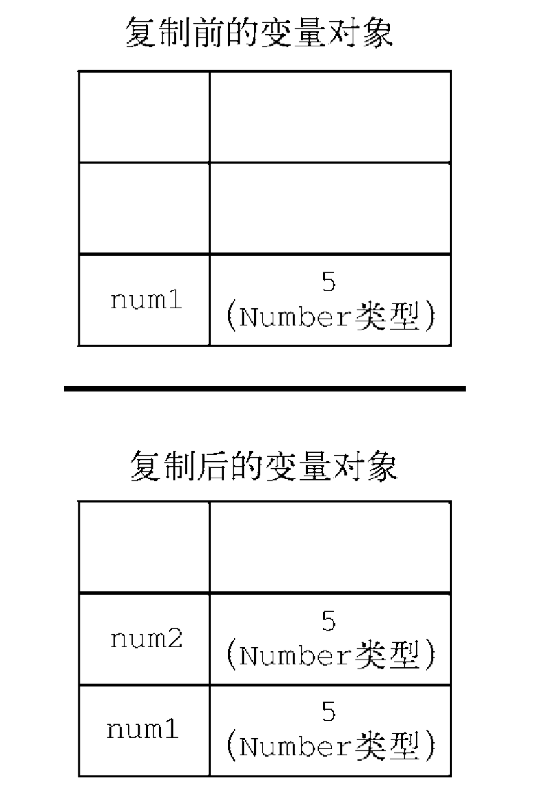
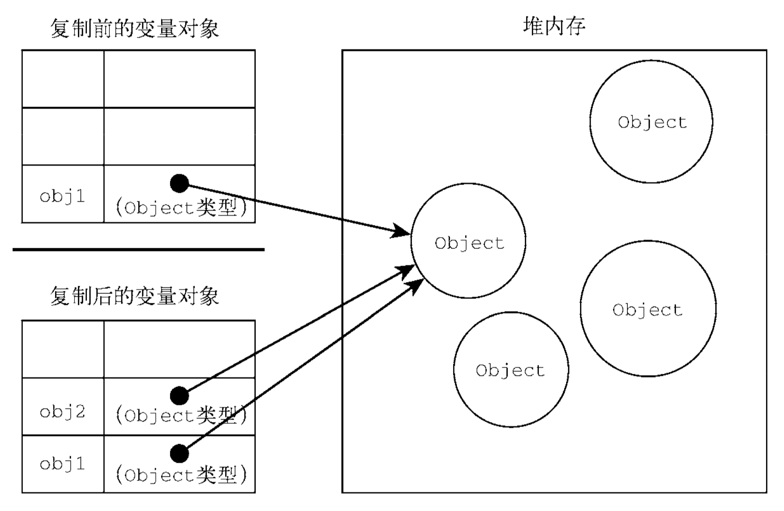

红宝书学习记录

### *原文整理摘抄自 javascript 高级程序开发(第4版) 第4章*

### 原始值与引用值
**原始值** 就是最简单的数据
> 目前有六种原始值 Undefined、Null、Boolean、Number、String 和 Symbol、BigInt

**引用值** 由多个值构成的对象
引用值是保存在内存中的对象。
JavaScript 不允许直接访问内存位置，因此也就 不能直接操作对象所在的内存空间。在操作对象时，实际上操作的是对该对象的引用(reference)而非 实际的对象本身。为此，保存引用值的变量是按引用(by reference)访问的。

#### 动态属性
原始值和引用值的定义方式很类似，都是创建一个变量，然后给它赋一个值。
对于引用值而言，可以随时添加、修改和删除其属性和方法。

#### 复制值
除了存储方式不同，原始值和引用值在通过变量复制时也有所不同。
- 原始值的存储复制完全独立，互不干扰
  
- 引用值存储在变量中的值也会被复制到新变量所在的位置。区 别在于，**这里复制的值实际上是一个指针，它指向存储在堆内存中的对象**。
  

#### 传递参数
ECMAScript 中所有函数的参数都是按值传递的。
这意味着函数外的值会被复制到函数内部的参数中，就像从一个变量复制到另一个变量一样。
- 如果是原始值，那么就跟原始值变量的复制一样
- 如果是 引用值，那么就跟引用值变量的复制一样。

#### 确定类型
`typeof` 确定值是不是对象
`instanceof` 反对元素是否是某个类型的实例

```js
result = variable instanceof constructor
```

```js
console.log(person instanceof Object); // 变量 person 是 Object 吗？
console.log(colors instanceof Array); // 变量 colors 是 Array 吗？
console.log(pattern instanceof RegExp); // 变量 pattern 是 RegExp 吗？
```

### 执行上下文与作用域
变量或函数的上下文决定 了它们可以访问哪些数据，以及它们的行为。

全局上下文是最外层的上下文。

上下文在其所有代码都执行完毕后会被销毁，包括定义 在它上面的所有变量和函数（全局上下文在应用程序退出前才会被销毁，比如关闭网页或退出浏览器）。

每个函数调用都有自己的上下文。当代码执行流进入函数时，函数的上下文被推到一个上下文栈上。 在函数执行完之后，上下文栈会弹出该函数上下文，将控制权返还给之前的执行上下文。 类似洋葱模型

上下文中的代码在执行的时候，会创建变量对象的一个作用域链（scope chain）。这个作用域链决定了各级上下文中的代码在访问变量和函数时的顺序。

代码执行时的标识符解析是通过沿作用域链逐级搜索标识符名称完成的。

```js
var color = "blue";

function changeColor() {
  if (color === "blue") {
    color = "red";
  } else {
    color = "blue";
  }
}
changeColor();
```
函数 changeColor()的作用域链包含两个对象
- 它自己的变量对象（就 是定义 `arguments` 对象的那个）
- 全局上下文的变量对象
这个函数内部之所以能够访问变量 color，就是因为**可以在作用域链中找到它**。

此外，局部作用域中定义的变量可用于在局部上下文中替换全局变量。

#### 作用域链增强
虽然执行上下文主要有全局上下文和函数上下文两种（eval()调用内部存在第三种上下文），但有其他方式来增强作用域链。
某些语句会导致在作用域链前端临时添加一个上下文，这个上下文在代码执行后会被删除
- try/catch 语句的 catch 块 (创建一个新的变量对象，这个变量对象会包含要抛出的错误对象的声明)
- with 语句 (会向作用域链前端添加指定的对象)
这两种情况下，都会在作用域链前端添加一个变量对象。

```js
function buildUrl() {
  let qs = "?debug=true";
  
  with(location) {
    let url = href + qs;
    return url;
  }
}
```
这里，with 语句将 location 对象作为上下文，因此 location 会被添加到作用域链前端。当 with 语句中的代码引用变量 href 时，实际上引用的是 location.href，也就是自己变量对象的属性。

#### 变量声明
var, let, const

1. 使用 var 的函数作用域声明
在使用 var 声明变量时，变量会被自动添加到最接近的上下文。
- 在函数中，最接近的上下文就是函数的局部上下文。
- 在 with 语句中，最接近的上下文也是函数上下文。
- 如果变量未经声明就被初始化了， 那么它就会自动被添加到全局上下文
  > var 声明会被拿到函数或全局作用域的顶部，位于作用域中所有代码之前。这个现象叫作“提升” （hoisting）。

2. 使用 let 的**块级作用域声明**
ES6 新增的 let 关键字跟 var 很相似，但它的作用域是块级的，这也是 JavaScript 中的新概念。
块级作用域由最近的一对包含花括号{}界定。
换句话说，if 块、while 块、function 块，甚至连单独 的块也是 let 声明变量的作用域。
   > 严格来讲，let 在 JavaScript 运行时中也会被提升，但由于“暂时性死区”（temporal dead zone）的 缘故，实际上不能在声明之前使用 let 变量。
   ```js
   for (let i = 0; i < 10; i ++) {
     setTimeout(() => {
       console.info(i);
     })
   }
   ```