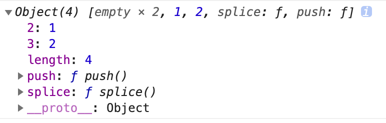

### ['1', '2', '3'].map(parseInt)

```js
// 1, NaN, NaN

parseInt("1", 0); // 1
parseInt("2", 1); // NaN
parseInt("3", 2); // NaN
```

### Set、Map、WeakSet 和 WeakMap 的区别

Set 和 Map 主要的应用场景在于 数据重组 和 数据储存
Set 是一种叫做集合的数据结构
Map 是一种叫做字典的数据结构

**WeakSet 与 Set 的区别**

- WeakSet 只能储存对象引用，不能存放值，而 Set 都可以
- WeakSet 对象中储存的对象值都是被弱引用的，垃圾回收机制不考虑 WeakSet 对该对象的应用，如果没有其他的变量或属性引用这个对象值，则这个对象将会被垃圾回收掉。
- Set 可以遍历， WeakSet 不可遍历

**WeakMap 与 Map 的区别**

- Map 本质上是键值对的集合，无键值限制， WeakMap 只接受对象作为键名（null 除外）的键名
- WeakMap 键名是弱引用，键值可以是任意的，键名所指向的对象可以被垃圾回收，此时键名是无效的
- Map 可以遍历， WeakMap 不能遍历

### ES5/ES6 的继承除了写法以外还有什么区别？

继承机制完全不同
ES5 通常是构造函数继承 和 原型链继承
**构造函数继承**

```js
function Parent(name) {
  this.name = name;
  this.getName = function () {
    return this.name;
  };
}

function Child(age, ...args) {
  this.age = age;
  Parent.apply(this, args);
}

var user = new Child(20, "李四");
console.log(user.getName());
console.log(user.age);
```

**原型链继承**

```js
function Parent(name) {
  this.name = name;
}
Parent.prototype.getName = function () {
  return this.name;
};

function Child(age) {
  this.age = age;
}

Child.prototype = new Parent("张三");
// Child.prototype.constructor === Parent.prototype.constructor = Parent

var user = new Child(20);
// user.constructor === Child.prototype.constructor === Parent
console.log(user.getName());
console.log(user.age);
```

- ES5 是先创建子类实例对象的 this，然后再将父类的方法添加到 this 上面（Parent.apply(this)）。
- ES6 的继承机制完全不同，实质是先将父类实例对象的属性和方法，加到 this 上面（所以必须先调用 super 方法），然后再用子类的构造函数修改 this。

### 以下代码执行结果

```js
var b = 10;
(function b() {
  b = 20;
  console.log(b);
})();
```

结果

```js
var b = 10;
(function b() {
  // 内部作用域，会先去查找是有已有变量b的声明，有就直接赋值20
  // IIFE的函数无法进行赋值（内部机制，类似const定义的常量），所以无效。
  // 在非匿名自执行函数中，函数变量为只读状态无法修改
  b = 20; // 执行无效
  console.log(b); // [Function b]
})();
```

### [3, 15, 81, 292, 102, 2012].sort(); 结果，原因？

结果

```js
// [102, 15, 2012, 292, 3, 81]
```

默认按照 `ASCII` 字符编码的顺序进行排序
实现数字大小排序效果

```js
[3, 15, 81, 292, 102, 2012].sort((a, b) => a - b);
```

### 以下代码输出结果

```js
var obj = {
  2: 3,
  3: 4,
  length: 2,
  splice: Array.prototype.splice,
  push: Array.prototype.push,
};
obj.push(1);
obj.push(2);
console.log(obj);
```

结果

[,,1,2], length 为 4

有 length 属性被定义为伪数组
因为 length 为 2 所以 push 会从第三个才是，也就是索引为 2 的位置，
0, 1 则是 empty
使用 push 属性会 length + 1，因此两次 push length 变成 4。

### 以下代码执行结果

```js
var a = { n: 1 };
var b = a;
a.x = a = { n: 2 };

console.log(a.x);
console.log(b.x);
```

结果

```js
a.x; // undefined
b.x; // { n: 2 }
```

a.x 的赋值操作被先执行
a.x 此时可以理解为 b.x;
b.x 最后被赋值 { n: 2 }
a 被赋值 { n: 2 }
因此
a.x undefined

### 为什么普通 for 循环的性能远远高于 forEach 的性能

- forEach 有诸多参数和上下文需要在执行的时候考虑进来
- for 循环则是底层写法，不会产生额外的消耗

### var、let 和 const 区别的实现原理是什么

- var 会直接在栈内存预分配内存空间，实际代码执行的时候再进行变量存储，如果传入的是应引用数据类型，则会在堆内存中开辟一个内存空间存储数据，栈内存存储的是数据的引用，指向堆内存地址。
- let 则不会预分配内存空间，而且在栈内存分配变量时，做一个检查，如果已经有相同变量名存在就会报错。
- const 与 let 一致 且变量不可变更修改，否则报错。

### 以下代码执行结果

```js
function changeObjProperty(o) {
  o.siteUrl = "http://www.baidu.com";
  o = new Object();
  o.siteUrl = "http://www.google.com";
}
let webSite = new Object();
changeObjProperty(webSite);
console.log(webSite.siteUrl);
```

结果 http://www.baidu.com
webSite 属于复合数据类型，函数参数中以地址传递，修改值会影响到原始值，但如果将其完全替换成另一个值，则原来的值不会受到影响

### 以下代码输出结果

```js
function Foo() {
  Foo.a = function () {
    console.log(1);
  };
  this.a = function () {
    console.log(2);
  };
}
Foo.prototype.a = function () {
  console.log(3);
};
Foo.a = function () {
  console.log(4);
};
Foo.a();
let obj = new Foo();
obj.a();
Foo.a();
```

结果： 4, 2, 1

```js
function Foo() {
  Foo.a = function () {
    console.log(1);
  };
  this.a = function () {
    console.log(2);
  };
}
// 以上只是 Foo 的构建方法，没有产生实例，此刻也没有执行

Foo.prototype.a = function () {
  console.log(3);
};
// 现在在 Foo 上挂载了原型方法 a ，方法输出值为 3

Foo.a = function () {
  console.log(4);
};
// 现在在 Foo 上挂载了直接方法 a ，输出值为 4

Foo.a();
// 立刻执行了 Foo 上的 a 方法，也就是刚刚定义的，所以
// # 输出 4

let obj = new Foo();
/* 这里调用了 Foo 的构建方法。Foo 的构建方法主要做了两件事：
1. 将全局的 Foo 上的直接方法 a 替换为一个输出 1 的方法。
2. 在新对象上挂载直接方法 a ，输出值为 2。
*/

obj.a();
// 因为有直接方法 a ，不需要去访问原型链，所以使用的是构建方法里所定义的 this.a，
// # 输出 2

Foo.a();
// 构建方法里已经替换了全局 Foo 上的 a 方法，所以
// # 输出 1
```

### 以下代码打印结果

```js
String("11") == new String("11");
String("11") === new String("11");
```

结果: true， false

- `==` 时做了隐式转换，调用了 toStringf 方法
- 2 者类型不一样，一个是 string，一个是 object

### 以下代码打印结果

```js
var name = "Tom";
(function () {
  if (typeof name == "undefined") {
    var name = "Jack";
    console.log("Goodbye " + name);
  } else {
    console.log("Hello " + name);
  }
})();
```

结果: Goodbye Jack
使用 var 在立即函数执行的时候，会有变量提升，此时匿名函数中 name 字段被定义为 undefined，但是并未赋值。因此走 if 条件，结果 Goodbye Jack

### 1 + "1"

结果: "11"
字符串拼接

### 2 \* "2"

结果: "4"
后面的 2 后台调用 Number()将其转换为数值，执行 \* 操作

### [1, 2] + [2, 1]

结果: "1, 22, 1"
Javascript 中所有对象基本都是先调用 valueOf 方法，如果不是数值，再调用 toString 方法。
所以两个数组对象的 toString 方法相加，值为："1,22,1"

### "a" + + "b"

结果: "aNaN"
后边的“+”将作为一元操作符，如果操作数是字符串，将调用 Number 方法将该操作数转为数值，如果操作数无法转为数值，则为 NaN。

### 以下代码执行结果

```js
function A() {
  this.name = "Tom";
  this.color = ["green", "yellow"];
}
function B() {}
B.prototype = new A();
var b1 = new B();
var b2 = new B();
b1.name = "Lily";
b1.color.push("black");
console.log(b1.name); // Lily
console.log(b2.name); // Tom
console.log(b1.color); // ["green", "yellow", "Lily"]
console.log(b2.color); // ["green", "yellow", "Lily"]
```

### e.target 和 e.currentTarget 区别

- e.target 返回触发事件的元素
- e.currentTarget 返回绑定事件的元素
