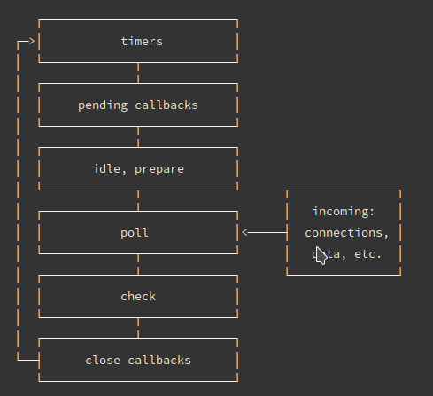

### node 事件循环

Node 10 及以前:


Libuv 是一个高性能的，事件驱动的异步 I/O 库，它本身是由 C 语言编写的，具有很高的可移植性。
**事件循环的 7 个主要阶段**
**times：** setTimeout setInterval 回调
**I/O callbacks：** 处理异步事件的回调，比如网络 I/O，比如文件读取 I/O。当这些 I/O 动作都**结束**的时候，在这个阶段会触发它们的回调。（上一轮循环的回调）
**idle, prepare：** 这个阶段内部做一些动作，仅 node 内部使用
**I/O poll 阶段：** 获取新的 I/O 事件，适当的条件下 node 将阻塞在这里
**check：** 执行 setImmediate() 回调
**close callback：** 关闭 I/O 的动作，比如文件描述符的关闭，socket 断开，等等等

> process.nextTick 的操作，会在每一轮事件循环的最后执行

- 执行全局 Script 的同步代码
- 执行 microtask 微任务，先执行所有 Next Tick Queue 中的所有任务
- 在执行 Other Microtask Queue 中的所有任务
- 执行完成之后开始执行 macrotask 宏任务，共 6 个阶段，每个阶段红任务执行完成之后，再执行 步骤 2 ，然后继续执行下一个阶段的宏任务，再执行 步骤 2。
- 如：Times Queue -> 步骤 2 -> I/O Queue -> 步骤 2 -> Check Queue -> 步骤 2 -> Close Callback -> 步骤 2 -> Times Queue -> ...
- 这就是 Node 的 Event Loop

Node 11 以后:
类似浏览器事件循环

### 介绍以下 nodejs 中间件

中间件主要是指封装 http 请求细节处理的方法。引入了 Node 中间件来简化和封装这些基础逻辑处理细节。

### node 性能优化

- 使用最新版本的 Node.js
- 避免使用同步代码
- 缓存静态文件
- 使用 gzip
- 实现 SSL/TLS 和 HTTP/2
- 读写分离
- 多进程架构

### node 错误监控

- 语法错误，运行时错误触发 JavaScript error
- 访问不存在的文件触发系统错误。
- 自定义 error

**日志**

- nginx log
- log4js
- pm2 log

### koa2 中间件原理。

🧅 洋葱模型
通过 use() 注册多个中间件放入数组中，从外层开始往内执行，遇到 next()执行下一个中间件，所有中间件执行完成之后，开始返回，一次执行中间件未执行的部分。

### node 如何进行跨域通信

Node 设置允许跨域

```js
res.header("Access-Control-Allow-Origin", "https://www.daiwei.site");
```

### require 原理

```js
let name = require("./a");
console.log(name);
```

上述代码引入 `a.js` 文件时候，内部大致发生的流程如下:

- 将 `./a` 转化为绝对路径，并且补充后缀名(`c:\Users\chenying\Desktop\code\a.js`)
- 根据绝对路径判断缓存中是否存在缓存的文件，如果存在则取缓存，不存在则继续
- 创建 `Module` 实例 `module`，将绝对路径传入
- 取得绝对路径的后缀名，根据后缀名(`.js`)调用对应的处理函数
- 读 `.js` 和 `.json` 文件思路大同小异，通过 fs.readFileSync()读取文件内容
- 对读到的 `.js` 文件的内容外层包裹一个函数，并且将字符串转成函数执行
- 对读到的 `.json` 文件的内容，转为对象，并且赋值给`module.exports`

### node 异常处理

- 使用 `try catch` 方式来处理异常
  > `try catch` 无法处理异步代码块内出现的异常
- 使用 `event` 方式来处理异常

  ```js
  const events = require("events");
  // 创建一个事件监听对象
  const emitter = new events.EventEmitter();
  // 监听error事件
  emitter.addListener("error", (e) => {
    // 处理异常信息
    console.log(11122222); // 能打印 1112222 说明异常捕获到了
    console.log(e);
  });
  // 触发 error事件
  emitter.emit("error", new Error("你代码出错了"));
  ```

- 自带的 `error first callback` 的方式
- `Promise` `catch` 方式
- `process` 方式 `uncaughtException`

  ```js
  process.on("uncaughtException", (e) => {
    console.log("我能进来，说明可以处理异常");
    console.log(e);
  });

  function testFunc() {
    throw new Error("error");
  }

  testFunc();
  ```
