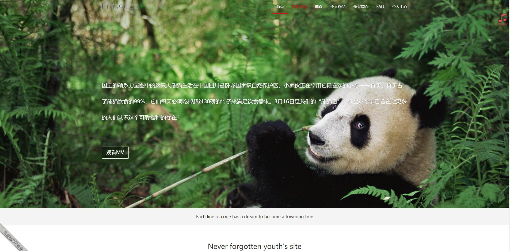
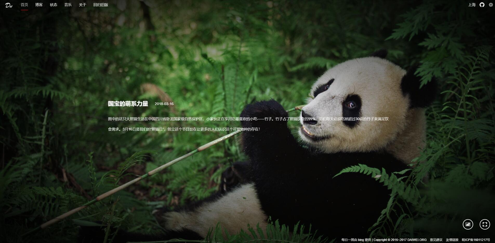

从2016年3月自学前端到现在已经有两年的时间了，自己也喜欢瞎捣鼓一些东西，个人也尝试做自己个人的网站买了相关的配置，个人网站版本迭代到第二个版本，写下这个文档主要是为了记录这两年个人网站的开发历程和未来网站的开发规划
<!-- more -->
## 个人网站2.0版本总结个未来规划
### 建站初衷：
- 看到别人的作品在网上能够被人看到，觉的网站开发的魅力深深的吸引了我，想自己也做一个
- 希望能了解建站的一体化流畅操作从而了解网页开发
- 工作之余学习方式
- 希望有自己的作品

### 建站准备
#### 域名
当时购买了一个域名，购买域名很便宜第一年通常也就50以内，购买域名之后还需要备案，需要有指定背景（当时是阿里寄过来的一个背景图纸），于是就站在背景前面拍了张照片并上传上去，执行后续的备案流程操作。提交成功之后大概等了十多天才审核通过，当时等的急的哦！
#### 虚拟主机
当时买的是共享虚拟主机，有流量限制的，之后环境搭建好了之后发现用的太快了之后升级了一个独享虚拟主机不限制流量的那种，就开始我的个人网站建设的准备了
#### 配置
阿里云个人后台配置的，网站查阅资料，经过一段时间琢磨真的搭建起来了 那个感觉真的是爽啊！

### 初版：

#### 建设功能：
首页展示，个人页信息，博客，作品信息，个人中心（后台管理），音乐播放
#### 技术框架与库:
javascript，html5，css3，jquery，ajax，bootstrap，部分页面使用基于AMD规范的模块化开发
#### 进度：
2016-6 至 2016-8
#### 问题：
1. 首页由于添加很多图片，以及音频资源请求导致页面加载很慢很慢，当时很了解html5音频的相关操作，代码还是比较不符合规范和逻辑的，之后有优化音频播放器，但是并没有再更新旧版本首页的播放器
2. 大多数都是静态页面，很多东西修改都不是通过后台操作改动，静态页面改动很频繁也很麻烦
3. 页面设计不合理，元素嵌套过多，代码混乱
4. 经过1年的技术学习和沉淀，加上刚开始学习vue框架，就开始想给之前的网站改版并使用vue2.0完成个人网站的开发

### 2.0版：

#### 建设功能：
首页bing壁纸和个人壁纸，个人状态信息，音乐，资源搜索，等等各种功能
#### 技术框架与库：
javascript，html5，css3，vue2.0，vuex，axios，bootstrap栅格系统css代码等，使用es6语言开发
#### 进度：
2017-5 至 至今
相对于v.10优化的地方
1. 单页面spa应用，用户体验好，按需加载首页加载速度提升了10倍以上
2. 代码书写相对之前有所提升，网站风格提升
3. 扩展的功能多资源搜索，每日笑话，新闻头条，以及版本信息等等
4. 使用当前热门的vue技术，开发更方便，组件化开发深入人心，虚拟dom的渲染机制使得页面性能更加优越
问题：
1. 部分地方使用了jqeury的animate实现歌词滚动的效果，作为一个基于vue的项目 使用jquery显得有点格格不入(已解决)
2. 项目越来越大的时候不方便管理，应该是开始代码的结构没有构思好，不方便维护
3. 单页面不利于SEO，虽说有相关插件可以将静态页面单独分隔，但是用户体验必定大打折扣

### 未来规划
1. 未来的网站可能还会基于vue，或者重写，但是务必解决的是seo的问题
2. 加入用户交互。初步的想法是：部分功能需要用户交互，听歌，建议，个人标签点赞等等都需要登录后才能操作(已实现))
3. 后台管理页面的搭建，方便个人后台管理操作(计划使用react + ant)
4. 拓展新功能，优化或重构之前的代码
5. 开发自己通用的组件库并发布npm包，方便使用（d-utils）

直到现在我还是在更新自己的网站，我喜欢这个行业，也会一直继续下去，努力成为一名合格的前端开发工程师!
