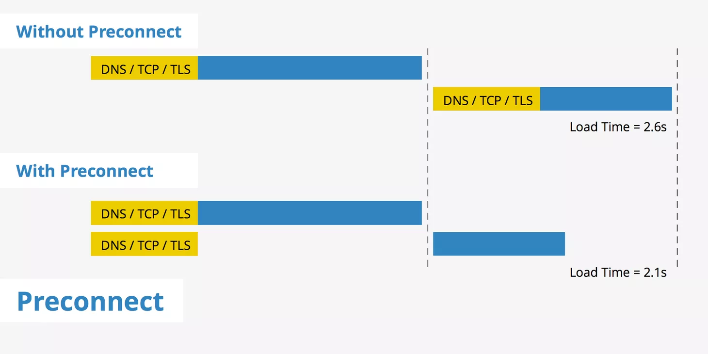

### 减少资源请求
- #### `css spirites`
  图片资源合并一张，background-position 显示
- #### 图片懒加载
  图片懒加载实现视口的资源请求，避免在没有曝光的情况下，加载不必要的资源
- #### http接口合并请求
  后端接口聚合 或者 中间层接口聚合(`graphQL`)

### 控制资源优先级
  - #### js css 排放位置
    css 位于body 顶部
    js 位于body 底部
  - #### 避免阻塞主线程（long Task）
    超过 50ms 的js任务可理解为 long Task，
  - #### 控制阻塞资源
    - ###### 控制 script type **`defer`** or  **`async`** 标签达到低优先级, 避免阻塞主线程
    
    - ###### 避免 `js` 存放于 head 中
  - #### css 避免阻塞
    当一个媒体查询的结果值计算出来是 false 的时候 (`media` 设置非 `all`)，浏览器仍然会下载样式表，但是不会在渲染页面之前等待样式表的资源可用
    ```jsx
    // jsx
    <link rel="stylesheet"
      href="https://fonts.googleapis.com/css2?family=Caveat&display=swap"
      media="none"
      onLoad={(rel) => {
      if (rel.currentTarget.media != 'all') {
        rel.currentTarget.media = 'all'
      }
    }}>
    </link> 
    ``` 

### CSS 优化
- #### content-visibility
  提高渲染性能，可以跳过在屏幕外的内容渲染初始化页面的加载时间
- #### CSS3 触发 GPU 加速
  使用 opcatiy or css 3d 触发 GPU 加速，配合will-change 通过告知浏览器该元素会有哪些变化，使浏览器提前做好优化准备，增强页面渲染性能
- #### 避免动态请求

### 预加载，预请求
- #### preconnect
  
  允许浏览器在将HTTP请求实际发送到服务器之前建立早期连接。可以预先启动诸如`DNS查找`，`TCP握手`和`TLS协商`之类的连接，从而消除了这些连接的往返延迟，并为用户节省了时间。
  #####  执行代码
  ```html
  // crossOrigin 设置 use-credentials 表示允许携带cookie信息
  <link rel="preconnect" href="//fonts.googleapis.com" crossOrigin='use-credentials'/>
  <link rel="preconnect" href="//hm.baidu.com" crossOrigin='use-credentials'/>
  <link rel="preconnect" href="//p3.music.126.net" crossOrigin='use-credentials'/>
  <link rel="preconnect" href="//m10.music.126.net" crossOrigin='use-credentials'/>
  ```
- #### dns-prefetch
  DNS Prefetch 是一种 DNS 预解析技术。
  浏览网页时，浏览器会在加载网页时对网页中的域名进行解析缓存，这样在你单击当前网页中的连接时就无需进行`DNS`的解析，减少用户等待时间，提高用户体验。
  ```html
  <link rel="dns-prefetch" href="//fonts.googleapis.com"/>
  <link rel="dns-prefetch" href="//hm.baidu.com"/>
  ```

### 缓存
- #### Http缓存

- cache-control，expires

- #### 模版数据缓存
  模板 JS + 数据填充，减少访问量大的页面频繁的资源请求导致性能损耗

#### ServiceWork缓存 + 离线缓存
使用 ServiceWork 实现静态资源，网络请求，甚至在离线环境下的数据展示，提升用户体验

### 体积优化
- #### js, css minify，文件压缩
  通过webpack, rollup 等打包工具实现 js, css 代码的压缩

- #### tree shaking
  tree shaking（树摇），摇掉不使用的代码，减少包体积（只支持 ES module）

- #### 优化CSS体积
  - css代码重用
  - 元素样式公共代码合并编写（复用）
  - css 代码缩写
    ```css
    margin: 15px 20px 12px 24px;
    border-top: thin solid #000000;
    ```
  - 删除不必要的零和单位
- #### GZIP
  基于文本（js，css...）的资源应该使用压缩（gzip）来最小化网络总字节
  ```nginx
    # 开启gzip压缩
    gzip  on;
    # 压缩类型
    gzip_types text/css text/javascript application/javascript image/jpeg image/png image/gif;
    # 超过1k以上压缩
    gzip_min_length 1k;
    # 等级1-9  9最小的压缩,传输最快 但是消耗cpu
    gzip_comp_level 6;
  ```

### 外部优化
- #### 静态资源CDN
  CDN (Content Delivery Network) 从技术上全面解决由于网络带宽小、用户访问量大、网点分布不均等原因，提高用户访问网站的响应速度
- #### WebWorker
  处理密集型运算时可使用 WebWorker 单独开辟线程, 让脚本单独创建一个 JavaScript 线程，以执行委托的任务

### webview优化
- #### 使用离线包而非服务器承载静态资源
  离线包的目的是为了客户端本地快速加载网页，达到页面秒开效果，但是这种资源请求协议不是http协议，在接口请求的时候可能会有跨域问题（IOS中常会遇到）

- #### 接口数据预加载
  接口数据在客户端做预加载请求，如客户端列表页点击访问详情页，详情页是 H5 ，通常情况下是整个 APP 的重要页面  
  **如：**  
  - 今日头条 的文章详情页面，会在列表页获取加载好的数据通过 webview 植入到 `localStorge` 中
  - 点击列表打开 文章列表，通过 文章id优先从缓存中获取数据，如果不存在，则走接口请求下发
  - 渲染页面
- #### JS预加载
  客户端在加载页面之前，后台打开webview预先加载代码内容
- #### 同层渲染
  H5中渲染原生的组件，并做降级处理（主要是提升用户体验）

### 其他
